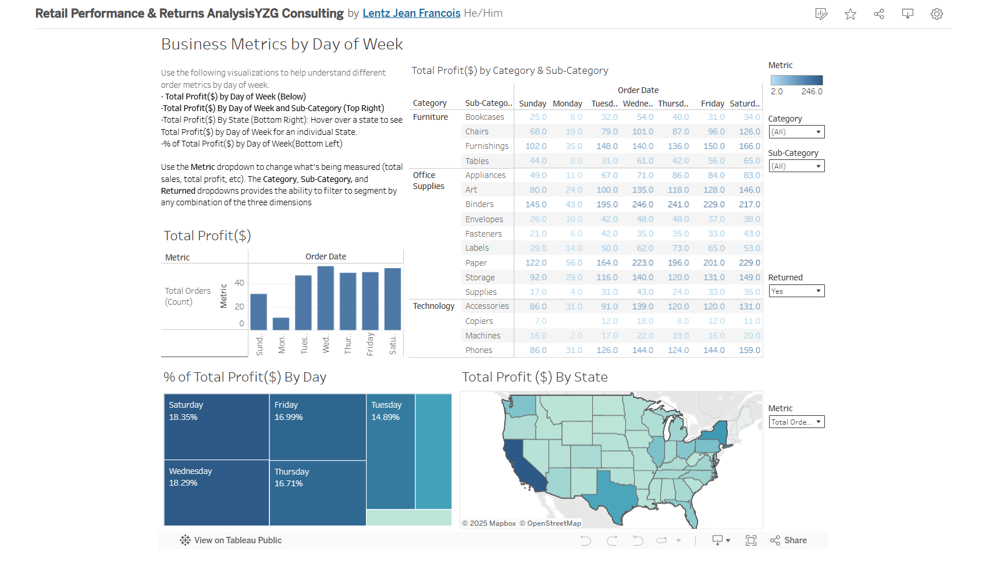

# 📊 Retail Performance & Returns Analysis (YZG Consulting)

> **[Click Here to View the Interactive Dashboard on Tableau Public](https://public.tableau.com/app/profile/lentz.francois/viz/RetailPerformanceReturnsAnalysisYZGConsulting/Dashboard1)**

> 

---

## 🏢 Business Overview
Analyzed retail order data to identify profit leakage, return patterns, and underperforming products impacting overall profitability.

The objective was to evaluate order volume trends, return behavior, and product performance to support data-driven decisions in pricing, inventory, and operational strategy.

---

## 📈 Key Insights
- **Friday Volume vs Profitability Trade-Off:**  
  Friday drives **17% of total order volume**, but higher return rates in key sub-categories reduce net profit

- **Consistent Loss Driver:**  
  The **Tables** sub-category remains unprofitable across all days, indicating structural pricing or logistics issues

- **Return Hotspots:**  
  **California** shows has the highest return volume, peaking on **Thursdays**, suggesting localized operational inefficiencies  

---

## 📊 Business Impact
- Identified key sources of profit leakage through return analysis  
- Highlighted underperforming product categories requiring strategic review  
- Provided insights to improve **pricing strategy, inventory allocation, and return reduction initiatives**  

---
🛠️ Tools & Techniques
Software: Tableau Desktop
Key Features:
Metric Parameter (Dynamic Switching): Toggle between Sales, Profit, Orders, and Profit Margin
Cross-Filtering: Enables interactive exploration across dimensions
Viz-in-Tooltip: Displays weekday performance within geographic views
Dashboard Layout Optimization: Structured for usability and consistency
___

## 📂 Project Structure
- `dashboard/retail_dashboard.twbx` → Tableau dashboard file  
- `images/` → Dashboard previews  
- `sql/` → Data cleaning and analysis queries  
- `docs/` → Methodology and approach  
- `reports/` → Final insights and recommendations  

---

## 💡 How to Use
1. Use the **Metric Parameter** to switch between Sales, Profit, Orders, and Profit Margin  
2. Filter by **Category** or **Return Status** to analyze profitability impact  
3. Hover over map regions to view **weekday performance breakdowns**  

---

## 👤 Author
**Lentz Jean Francois**  
Marketing / Data Analyst
